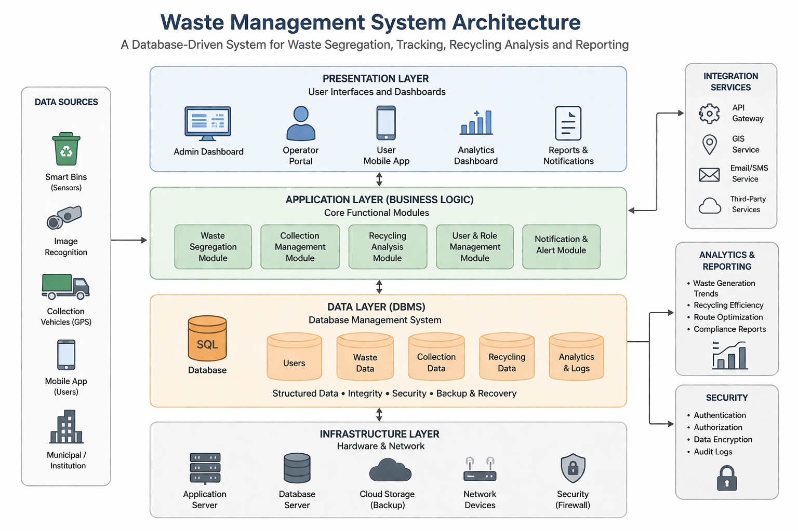
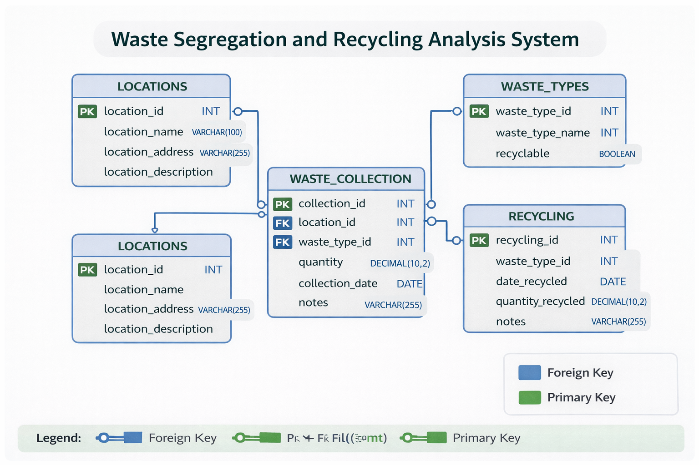
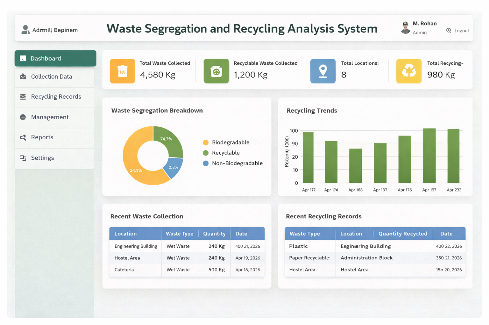

# ♻️ Waste Segregation and Recycling Analysis System
Waste Segregation and Recycling Analysis System


---

## 📌 Project Description

The Waste Segregation and Recycling Analysis System is a database-driven project designed to efficiently manage and analyze waste data. It helps in tracking waste types, quantities, locations, and recycling efficiency using DBMS concepts.

This system improves waste management by providing structured data storage, analysis, and reporting.

---

## 🎯 Objectives

* Record and manage different types of waste
* Analyze waste generation patterns
* Improve recycling efficiency
* Support environmental sustainability

---

## 🛠 Technologies Used

* MySQL
* SQL
* DBMS Concepts
* (Optional) HTML, CSS for frontend

---

## ⚙️ System Implementation

### 🗃 Database Design

The system consists of four main tables:

1. **locations**

   * Stores waste collection locations

2. **waste_types**

   * Stores types of waste (Wet, Dry, Plastic)

3. **waste_collection**

   * Stores waste quantity, type, location, and date

4. **recycling**

   * Stores recycled waste quantity

---

### 🔗 Relationships

* `location_id` → links locations & waste_collection
* `waste_type_id` → links waste_types & waste_collection
* `collection_id` → links waste_collection & recycling

---

### ⚡ Features

* Data insertion using SQL
* Data retrieval using SELECT queries
* Waste analysis using:

  * SUM()
  * JOIN
  * GROUP BY
* Recycling efficiency calculation

---

## 💻 SQL Implementation

### 🔹 Create Database

```sql
CREATE DATABASE waste_management;
USE waste_management;
```

---

### 🔹 Create Tables

```sql
CREATE TABLE locations (
  location_id INT PRIMARY KEY,
  location_name VARCHAR(50)
);

CREATE TABLE waste_types (
  waste_type_id INT PRIMARY KEY,
  waste_type VARCHAR(50)
);

CREATE TABLE waste_collection (
  collection_id INT PRIMARY KEY,
  location_id INT,
  waste_type_id INT,
  quantity INT,
  date DATE,
  FOREIGN KEY (location_id) REFERENCES locations(location_id),
  FOREIGN KEY (waste_type_id) REFERENCES waste_types(waste_type_id)
);

CREATE TABLE recycling (
  recycle_id INT PRIMARY KEY,
  collection_id INT,
  recycled_quantity INT,
  FOREIGN KEY (collection_id) REFERENCES waste_collection(collection_id)
);
```

---

### 🔹 Insert Data

```sql
INSERT INTO locations VALUES
(1, 'Hostel A'),
(2, 'Hostel B'),
(3, 'Canteen');

INSERT INTO waste_types VALUES
(1, 'Wet Waste'),
(2, 'Dry Waste'),
(3, 'Plastic');

INSERT INTO waste_collection VALUES
(1, 1, 1, 10, '2026-04-01'),
(2, 2, 2, 5, '2026-04-01'),
(3, 3, 3, 8, '2026-04-02'),
(4, 1, 2, 6, '2026-04-02');

INSERT INTO recycling VALUES
(1, 1, 6),
(2, 2, 3),
(3, 3, 5),
(4, 4, 4);
```

---

### 🔹 Analysis Queries

```sql
-- Total Waste
SELECT SUM(quantity) AS total_waste FROM waste_collection;

-- Location-wise Waste
SELECT l.location_name, SUM(wc.quantity) AS total
FROM waste_collection wc
JOIN locations l ON wc.location_id = l.location_id
GROUP BY l.location_name;

-- Most Generated Waste Type
SELECT wt.waste_type, SUM(wc.quantity) AS total
FROM waste_collection wc
JOIN waste_types wt ON wc.waste_type_id = wt.waste_type_id
GROUP BY wt.waste_type
ORDER BY total DESC
LIMIT 1;

-- Recycling Efficiency
SELECT (SUM(r.recycled_quantity) / SUM(wc.quantity)) * 100 AS recycling_percentage
FROM waste_collection wc
JOIN recycling r ON wc.collection_id = r.collection_id;
```

---

## 📊 Output & Diagrams

### 🏗 Architecture Diagram



### 🗃 Database Schema



### 📈 Results



---

## ▶️ How to Run the Project

1. Open MySQL Workbench / phpMyAdmin
2. Copy and run the SQL code
3. Execute queries
4. View output results

---

## 📄 Project Report

👉 Place your report inside:

```
report/project-report.pdf
```

---

## 📁 Project Structure

```
waste-management-system/
│
├── README.md
├── report/
│   └── project-report.pdf
├── sql/
│   └── waste_management.sql
├── images/
│   ├── architecture.png
│   ├── schema.png
│   └── output1.png
```

---

## 👨‍💻 Team Members

* M. Rohan
* P. Srujan
* T. Thrishanth

---

## 🌍 Conclusion

This project demonstrates how DBMS can be used in real-world applications to improve waste management. It helps in tracking waste, analyzing patterns, and enhancing recycling efficiency, contributing to a cleaner and more sustainable environment.

